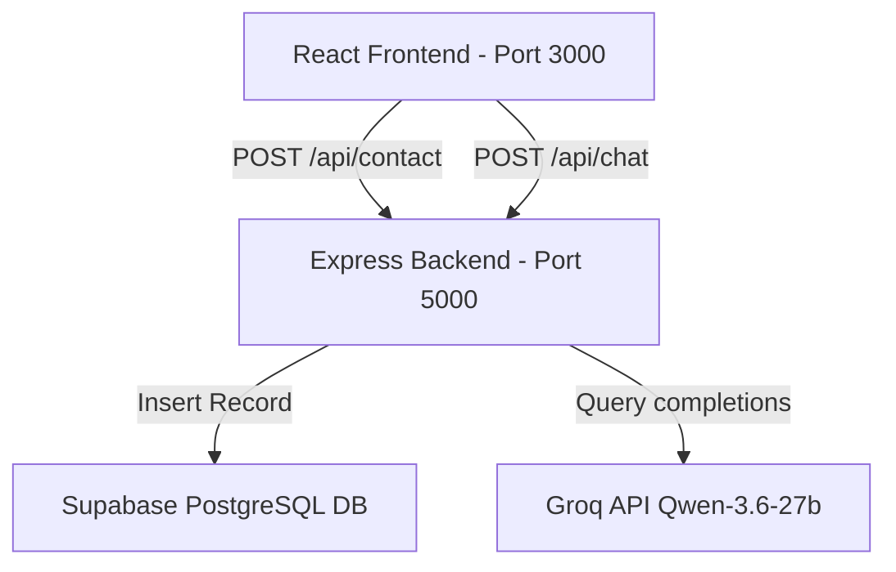

# Akarsh Raj A P — Personal Portfolio Website

This repository contains the source code for the professional portfolio website of **Akarsh Raj A P** (GenAI Consultant, Cloud Architect, and Full-Stack Technical Trainer). 

The design is built following the **Swiss Typographic Style**: a brutally minimalist, single-column design using neo-grotesque typography, high-contrast font weights, abundant whitespace, and zero container lines, borders, or filled background colors.

## Project Structure

```text
├── backend/                  # Node.js & Express.js server
│   ├── .env.example          # Environment variables template
│   ├── chatHandler.js        # Chat RAG database, keyword retriever & Groq API handler
│   ├── package.json          # Server dependencies & scripts
│   └── server.js             # API entrypoint, Supabase routes & Chat endpoint
└── frontend/                 # React.js SPA (Vite + React Router)
    ├── public/               # Public assets (profile photo, resume PDF)
    ├── src/
    │   ├── components/       # UI Components (Navbar, Chatbot, etc.)
    │   ├── pages/            # View Pages (Home, About, Skills, Projects, Contact)
    │   ├── App.jsx           # App layout, Chatbot mounting & routing
    │   ├── index.css         # Swiss Typographic stylesheet (Brutalist chatbot styles)
    │   └── main.jsx          # React entrypoint
    ├── index.html            # Main HTML document & metadata
    ├── package.json          # Frontend dependencies & scripts
    └── vite.config.js        # Vite configurations
```

---

## Architecture & Workflow



1. **Frontend**: Built using React.js, Vite, and React Router. Visual hierarchy is handled through clean CSS styling rules focusing purely on typography. Submitting the contact form calls `/api/contact`, while chatting with the virtual assistant queries `/api/chat`.
2. **Backend**: An Express.js gateway. It handles DB submissions with Supabase, and processes chatbot requests by executing an in-memory keyword-overlap retriever (RAG) that extracts matching portfolio documents and code explanations to ground the Groq system prompt.
3. **Groq Inference**: The backend queries Groq's completions endpoint using the `qwen/qwen3.6-27b` model, suppressing reasoning tokens (`reasoning_format: "hidden"`) for direct, concise outputs.
4. **Database**: A Supabase PostgreSQL instance storing form inquiries inside a structured `contacts` table.

---

## Database Setup (Supabase)

Execute the following SQL query in your **Supabase SQL Editor** to create the required table:

```sql
-- Create contacts table
create table contacts (
  id uuid default gen_random_uuid() primary key,
  name text not null,
  email text not null,
  message text not null,
  created_at timestamp with time zone default timezone('utc'::text, now()) not null
);

-- (Optional) Enable security policies or row-level security if needed:
alter table contacts enable row level security;

-- (Optional) Allow service role or public insert access depending on your API security needs:
create policy "Allow public inserts" on contacts
  for insert with check (true);
```

---

## Environment Variables

Inside the `backend/` directory, create a `.env` file (copied from `.env.example`) and configure your Supabase and Groq keys:

```env
PORT=5000
SUPABASE_URL=https://your-project-id.supabase.co
SUPABASE_ANON_KEY=your-supabase-anon-public-key
GROQ_API_KEY=gsk_your_groq_api_key_here
GROQ_MODEL=qwen/qwen3.6-27b
```

*Note: If `GROQ_API_KEY` is missing or uses the placeholder value, the chatbot operates in a safe **Fallback Debugging Mode** that returns matched RAG topics without failing.*

---

## Startup & Installation Commands

Follow these steps to run both services locally.

### 1. Install & Run Backend Server

In a new terminal window:

```bash
# Navigate to backend directory
cd backend

# Install server dependencies
npm install

# Start development server (using nodemon)
npm run dev
```

The backend server will launch at `http://localhost:5000`.

### 2. Install & Run Frontend Client

In another terminal window:

```bash
# Navigate to frontend directory
cd frontend

# Install client dependencies
npm install

# Start Vite local development server
npm run dev
```

The frontend application will launch at `http://localhost:3000`. Open this URL in your web browser.

---

## Key Features

### 1. Floating AI Assistant Chatbot
- A sleek, floating chatbot toggle button in the bottom-right corner styled to fit the Swiss Brutalist aesthetic.
- Uses an **in-memory RAG database** that has indexed both portfolio resume facts (experience, skills, projects) and the codebase files themselves (explaining the roles of `server.js`, `Contact.jsx`, `Chatbot.jsx`, `index.css`, and `render.yaml`).
- Configured to filter out thinking tags and reasoning chunks, providing only clean, direct answers.

### 2. Contact Form Feedback
- Upon successfully submitting a contact request, a custom black-and-silver confetti burst (`canvas-confetti`) is fired to celebrate the interaction, fitting seamlessly into the Swiss typographic style.

### 3. Test & Debug Agent (Project-specific)
- An integrated Test & Debug page has been added to the frontend that allows the AI Testing Agent to analyze this repository and run quick, local checks.
- The frontend exposes a `Tests` page (route `/tests`) that calls a backend endpoint to generate a test plan and execute quick checks.

Backend endpoint:
- `POST /api/test-project` — scans the repository (`frontend/src` and `backend/`), requests a JSON test plan from Groq (if `GROQ_API_KEY` is configured), and runs quick local checks:
  - Node syntax checks (`node --check`) across scanned files.
  - Runs `npm test` in `frontend/` and `backend/` when a test script is present in `package.json`.

Response structure (JSON):
- `success`: boolean
- `groqRaw`: raw LLM output (string) or null
- `plan`: JSON test plan (object)
- `syntax`: array of syntax-check failures
- `packageTestRuns`: array with npm test run results
- `scannedFiles`: number of files scanned

Environment variables (additional):
- `GROQ_API_KEY` — required for full LLM-generated test plans. If missing, the handler returns a safe fallback plan and still runs local checks.
- `GROQ_MODEL` — optional Groq model override (defaults to `qwen/qwen3.6-27b`).

Quick curl example to run tests (backend must be running):
```bash
curl -X POST http://localhost:5000/api/test-project \
  -H "Content-Type: application/json" \
  -d '{"category":"Syntax Check"}'
```

Notes and recommendations:
- The Test & Debug endpoint performs lightweight operations by default (`node --check`, `npm test` where configured). For deeper linting or test suites (Jest, Vitest, Playwright), add the relevant devDependencies and test scripts to `frontend/package.json` and/or `backend/package.json`.
- Ensure `node` is available in your PATH and is a recent LTS (Node 18+ recommended) so `node --check` and other commands run reliably.

UI / E2E testing:
- The test system can run Playwright UI tests located under `frontend/tests` when you select the `UI Testing` category in the Tests page or call the backend endpoint with `{ "category": "UI Testing" }`.
- Install Playwright browsers after `npm install` in the frontend with:
```bash
cd frontend
npx playwright install --with-deps
```
- Run the UI tests locally with:
```bash
cd frontend
npm test
```


