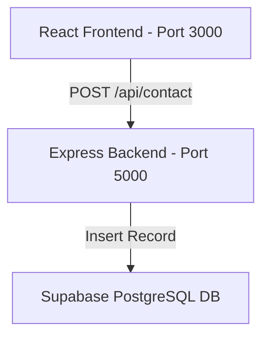

# Akarsh Raj A P — Personal Portfolio Website

This repository contains the source code for the professional portfolio website of **Akarsh Raj A P** (GenAI Consultant, Cloud Architect, and Full-Stack Technical Trainer). 

The design is built following the **Swiss Typographic Style**: a brutally minimalist, single-column design using neo-grotesque typography, high-contrast font weights, abundant whitespace, and zero container lines, borders, or filled background colors.

## Project Structure

```text
├── backend/                  # Node.js & Express.js server
│   ├── .env.example          # Environment variables template
│   ├── package.json          # Server dependencies & scripts
│   └── server.js             # API entrypoint & Supabase logic
└── frontend/                 # React.js SPA (Vite + React Router)
    ├── public/               # Public assets (profile photo, resume PDF)
    ├── src/
    │   ├── components/       # UI Components (Navbar, etc.)
    │   ├── pages/            # View Pages (Home, About, Skills, Projects, Contact)
    │   ├── App.jsx           # App layout & routing configuration
    │   ├── index.css         # Swiss Typographic global stylesheet
    │   └── main.jsx          # React entrypoint
    ├── index.html            # Main HTML document & metadata
    ├── package.json          # Frontend dependencies & scripts
    └── vite.config.js        # Vite configurations
```

---

## Architecture & Workflow



1. **Frontend**: Built using React.js, Vite, and React Router. Visual hierarchy is handled through clean CSS styling rules focusing purely on typography. Submitting the Contact form calls the Express API backend.
2. **Backend**: A Node/Express server acting as an API gateway. It validates input parameters, handles errors, and uses the Supabase SDK client to securely communicate with the database.
3. **Database**: A Supabase PostgreSQL instances storing form inquiries inside a structured `contacts` table.

---

## Database Setup (Supabase)

Execute the following SQL query in your **Supabase SQL Editor** to create the required table:

```sql
-- Create contacts table
create table contacts (
  id uuid default gen_random_uuid() primary key,
  name text not null,
  email text not null,
  message text not null,
  created_at timestamp with time zone default timezone('utc'::text, now()) not null
);

-- (Optional) Enable security policies or row-level security if needed:
alter table contacts enable row level security;

-- (Optional) Allow service role or public insert access depending on your API security needs:
create policy "Allow public inserts" on contacts
  for insert with check (true);
```

---

## Environment Variables

Inside the `backend/` directory, create a `.env` file (copied from `.env.example`) and fill in your Supabase project credentials:

```env
PORT=5000
SUPABASE_URL=https://your-project-id.supabase.co
SUPABASE_ANON_KEY=your-supabase-anon-public-key
```

---

## Startup & Installation Commands

Follow these steps to run both services locally.

### 1. Install & Run Backend Server

In a new terminal window:

```bash
# Navigate to backend directory
cd backend

# Install server dependencies
npm install

# Start development server (using nodemon)
npm run dev
```

The backend server will launch at `http://localhost:5000`.

### 2. Install & Run Frontend Client

In another terminal window:

```bash
# Navigate to frontend directory
cd frontend

# Install client dependencies
npm install

# Start Vite local development server
npm run dev
```

The frontend application will launch at `http://localhost:3000`. Open this URL in your web browser.

---

## Contact Form Success Feedback

Upon successfully submitting a contact request, a custom black-and-silver confetti burst (`canvas-confetti`) is fired to celebrate the interaction, fitting seamlessly into the Swiss typographic style.
